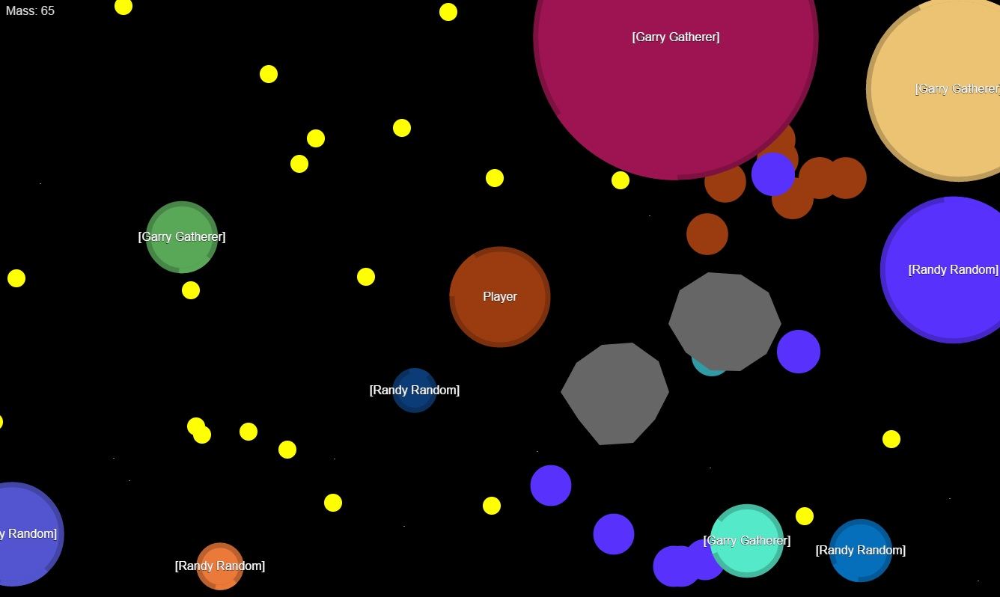

# Cellicle

**2D Browsergame, Agar.io clone, NodeJS, Real-time**

This is a simple 2D browser game build with NodeJS (server side) and JavaScript in general.

===

Some strange bio-mass virus tries to conquer the universe! It aims to eat every asteroids (small yellow circles) in its way. Yes, with its scifimagical abilities it's able to eat yellow asteroids like popcorn. Delicious! But eating asteroids is not enough. Feed on other players (aka biomass) as well! But be aware, you can only eat smaller blobs. And never try to eat plaentoids (big gray polygons). if you are smaller than them u automagically land on their dark side and they protect you from other players. But if you are bigger you will collide and lose mass! If you have to escape press `spacebar` to expell one third of your mass to provide propulsion. Or press `e` to lose three quarters of your mass in an explosion but to gain a huge speed boost. You are even capable of using your bio-mass as a weapon! Use your mouse to left click and to fire up to one twentieth of your mass on your opponents. Never forget, if your projectiles have lost their speed opponents are able to feed on it!

===

* To start the server: `nodejs server.js` (You will have to end it manually by terminating the process)
* The server will listen to port 8080 of the system and will use the websocket protocol. Example: `ws://localhost:8080/` 
